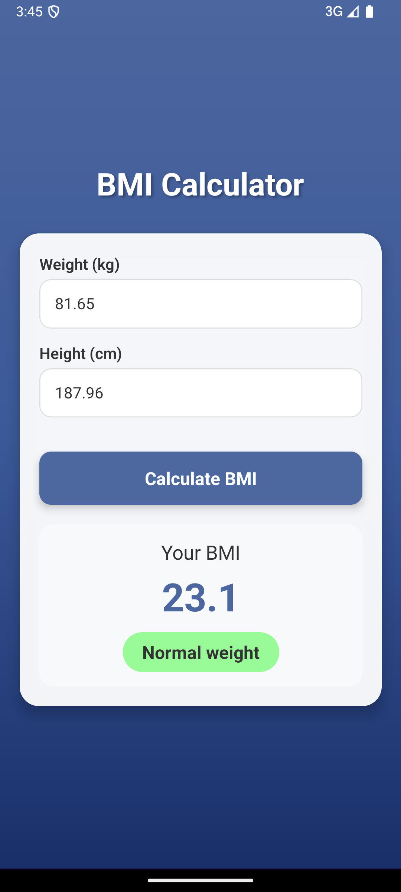

# BMI Calculator App

A sleek and intuitive Body Mass Index (BMI) calculator built with React Native and Expo.



## Features

- Calculate BMI using weight (kg) and height (cm)
- Real-time BMI category classification
- Color-coded results based on BMI category
- Smooth animations for results display
- Clean and modern gradient UI

## BMI Categories

- Underweight: < 18.5 (Salmon color)
- Normal weight: 18.5 - 24.9 (Light green)
- Overweight: 25 - 29.9 (Gold)
- Obese: ≥ 30 (Light red)

## Technologies Used

- React Native
- Expo
- TypeScript
- expo-linear-gradient
- React Native Animated

## Getting Started

1. Clone the repository:

    ```bash
    git clone https://github.com/your-username/bmi-calculator-app.git
    ```

2. Install dependencies:

    ```bash
    npm install
    ```

3. Start the app:

    ```bash
    npm start
    ```

4. Run the app on your device or emulator.

## License

This app is released under the [0BSD license](https://choosealicense.com/licenses/0bsd/).